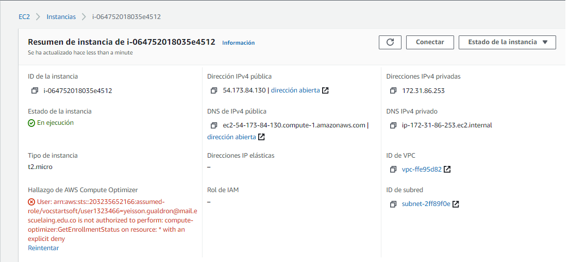
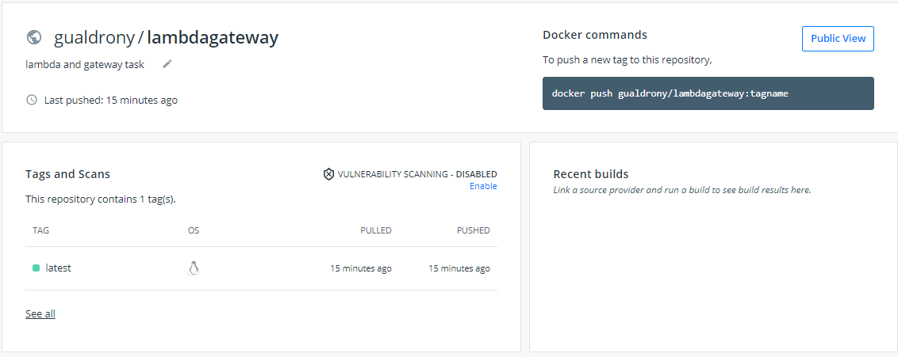
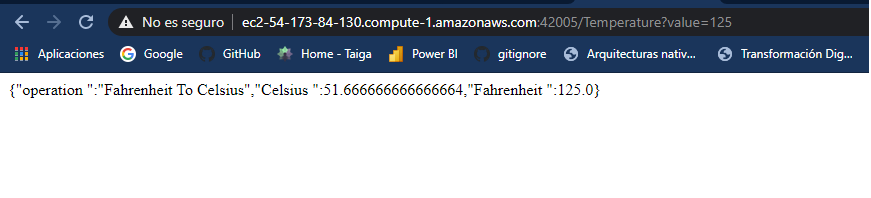

# Taller Arep Lambda Gateway 

Se realizó el desarrollo de una aplicación web cual busca convertir grados Fahrenheit a Celsius.
La aplicación web retorna un objeto Json con los valores Operación, Fahrenheit  y Celsius.


## Pre-requisitos

*  [MAVEN](https://maven.apache.org/) - Administrador de dependencias.

*  [GIT](https://git-scm.com/) - Control de versiones.

* [JAVA](https://java.com/) - Lenguaje de programación.

Para estar seguro de las versiones que posee de maven, git y de java ejecute los siguientes comandos:

```

mvn -version

```

```

git --version

```

```

java -version

```

## Instalación

Para descargar el proyecto desde GitHub ejecute la siguiente linea:

```

git clone https://github.com/GYEISSON/Taller-Arep-Lambda-Gateway.git

```

## Ejecutar

Dentro del directorio parcial-app, para compilar ejecutamos la siguiente linea:

```

mvn package

```

Para ejecutar el proyecto ejecutamos la siguiente linea:

```

java -cp target\MyLambda-1.0-SNAPSHOT.jar edu.escuelaing.arep.App

```

Para generar la documentación ejecutamos la siguiente linea:

```

mvn javadoc:javadoc

```

La documentación quedará en la ruta \target\site\apidocs\edu\eci\escuelaing\arep
## Despliegue en AWS 
EC2 Instancia creada  



Repositorio de docker 



Aplicación desplegada y ejecutandose en AWS, en la instancia EC2




## Ejecutando las pruebas

Para correr las pruebas ejecutamos la siguiente linea:

```

mvn test

```

## Construido con

*  [MAVEN](https://maven.apache.org/) - Administrador de dependencias.

*  [GIT](https://git-scm.com/) - Control de versiones.

*  [JUNIT](https://junit.org/junit5/) - Framework para realizar y automatizar pruebas.

* Java - Lenguaje de programación.  

## Autor

*  **Yeisson Gualdron** - [GYEISSON](https://github.com/GYEISSON)


## Licencia

Este proyecto está bajo la Licencia GNU(General Public License) - mira el archivo [LICENSE](LICENSE) para detalles.

